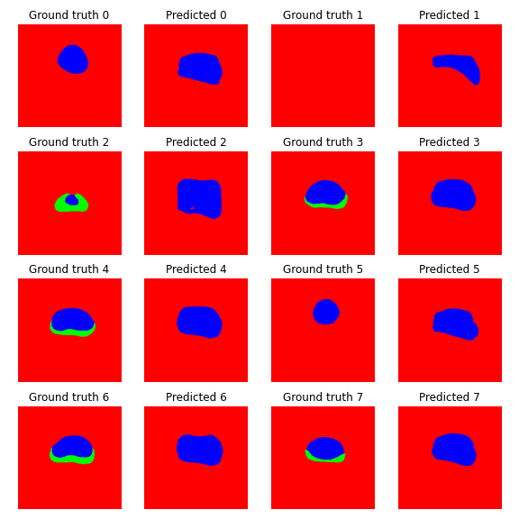

# Machine Learning for Health Care
This repository is meant to showcase all projects for the course "Machine Learning for Healthcare" at ETHZ in spring semester 2020.

These projects were done in a group of three, group members were Alicja Chaszczewicz, Anastasia Sycheva and me.

### Project 1: ECG Heartbeat Classification
This project compared several neural network architectures (including CNNs, RNNs and LSTMs) for classifying two different ECG datasets. 

### Project 2: Natural Language Processing
This project consisted out of two parts: In the first part, we built a basic NLP pipeline to predict readmittance to a hospital, based on textual patient files. In the second part, we built a simple semantic search function for a database of 47K Covid19-related papers.

### Project 3: Image Segmentation
In this project we built an image segmentation system for 3D prostate magnetic resonance images. We trained a UNET architecture to accurately predict background, peripheral zone and central gland zone (see GIF below).

